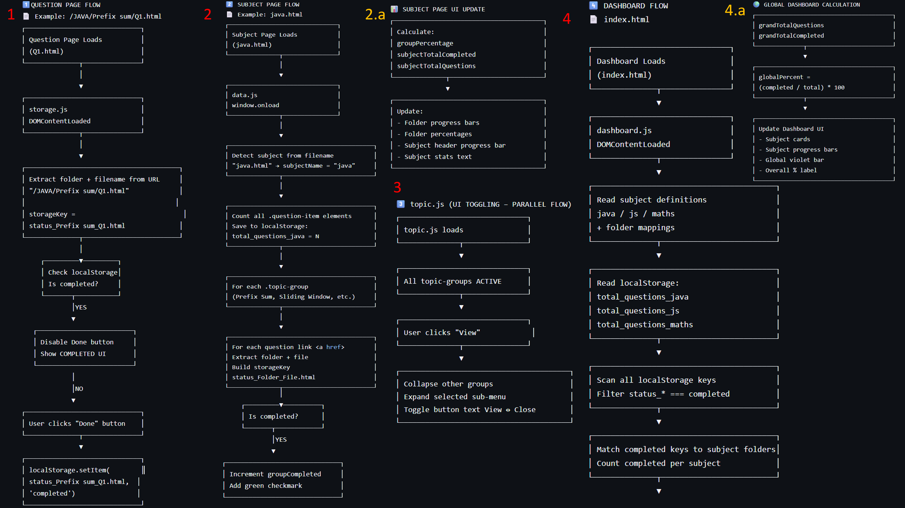

# 📘 Prepzy – Smart Exam Preparation Platform

## 📌 Project Description

**Prepzy** is a web-based exam preparation platform designed to help students practice questions topic-wise, track progress, and visualize completion across subjects.  
The project is implemented using **HTML, CSS, and Vanilla JavaScript**, with a strong emphasis on **DOM manipulation**, **localStorage-based state management**, and **multi-page script coordination**.

Prepzy follows a **decentralized page structure with centralized storage logic**, simulating how real-world front-end applications manage shared state across multiple views without a backend.

---

## ❓ Problem Statement

Students preparing for technical and academic exams often face difficulties such as:
- Managing revision of important questions and topics across multiple subjects.
- Tracking completed vs pending questions
- Maintaining progress across multiple study sessions

Traditional preparation methods lack **interactivity**, **progress persistence**, and **visual feedback**.

**Prepzy aims to solve this problem** by providing a browser-based solution that enables structured preparation, persistent progress tracking, and clear visual indicators.

---

## ✨ Features Implemented

- 📂 Subject-wise and topic-wise question organization  
- 📝 Individual question pages with completion tracking  
- ✅ Persistent progress storage using `localStorage`  
- 📊 Topic-level, subject-level, and global progress calculation  
- 🔗 Multi-page navigation with shared data state  
- 📈 Central dashboard with overall completion percentage  
- 🟢 Visual completion indicators (checkmarks, progress bars)

---

## 🧩 DOM Concepts Used

The project makes extensive use of core DOM concepts, including:

- `DOMContentLoaded` and `window.onload`
- `document.querySelector()` and `querySelectorAll()`
- Dynamic element creation and manipulation
- Event handling using `addEventListener()`
- Conditional rendering of UI components
- Progress bar updates using inline styles
- Reading and writing persistent data using `localStorage`
- Cross-page DOM synchronization using shared keys

---

## 🧠 Script Architecture & Execution Flow

Prepzy follows a **layered, event-driven script architecture** where different scripts handle specific responsibilities while sharing a common storage layer.

This design ensures:
- Clear separation of concerns
- Reusable logic
- Scalable front-end structure

---

### 📌 Architecture Overview Diagram

> 📁 Place this image in the **root directory** of the repository  
> 📄 Filename: `Script-architecture.png`



---

### 🧱 Major Script Flows Explained

---

### 1️⃣ Question Page Flow  
*(Example: `/JAVA/Prefix sum/Q1.html`)*

- Question page loads
- `storage.js` runs on `DOMContentLoaded`
- Folder name and filename are extracted from the URL
- A unique `localStorage` key is generated per question
- Completion status is checked from storage
- UI updates dynamically:
  - If completed → **Done button disabled**, completed UI shown
  - If not completed → user can mark question as done
- Clicking **Done** stores completion status in `localStorage`

---

### 2️⃣ Subject Page Flow  
*(Example: `java.html`)*

- Subject page loads
- Subject name is detected from filename
- Total questions are counted dynamically
- All topic groups are scanned
- Completion status of each question is checked
- Topic-level and subject-level progress is calculated
- UI updates include:
  - Topic progress bars
  - Folder percentages
  - Subject header progress indicator

---

### 3️⃣ Topic Toggle Logic (`topic.js` – Parallel Flow)

- Handles UI-only interactions
- Runs independently from progress calculations
- Allows expanding and collapsing topic groups
- Ensures only one topic group is expanded at a time
- Toggles button text between **View** and **Close**

---

### 4️⃣ Dashboard Flow  
*(Dashboard: `index.html`)*

- Dashboard loads
- `dashboard.js` executes on `DOMContentLoaded`
- Subject definitions and folder mappings are read
- Total questions per subject are fetched from storage
- All `status_*` keys are scanned from `localStorage`
- Completed questions are counted per subject
- Dashboard UI is updated dynamically

---

### 4️⃣.a Global Dashboard Calculation

- Aggregates:
  - Total number of questions across all subjects
  - Total completed questions
- Calculates global progress:
  
 ```globalPercent = (completed / total) * 100```

yaml
Copy code
- Updates:
- Subject cards
- Subject progress bars
- Global progress bar
- Overall percentage label

---

## ▶️ Steps to Run the Project

1. Clone or download the repository:
 ```bash
 git clone <repository-url>
Open the project folder.

Start the application by opening:

diff
Copy code
index.html
Navigate through subjects, topics, and questions using the UI.
  
✅ No server, backend, or database setup required.
```

## ⚠️ Known Limitations
-Progress is stored only in browser localStorage
-Data does not sync across devices or browsers
-No authentication or user login system
-UI is optimized mainly for desktop screens
-Manual clearing of localStorage required to reset progress

## 🧑‍💻 Technologies Used
- HTML5
- CSS3
- JavaScript (ES6)
- Browser LocalStorage
